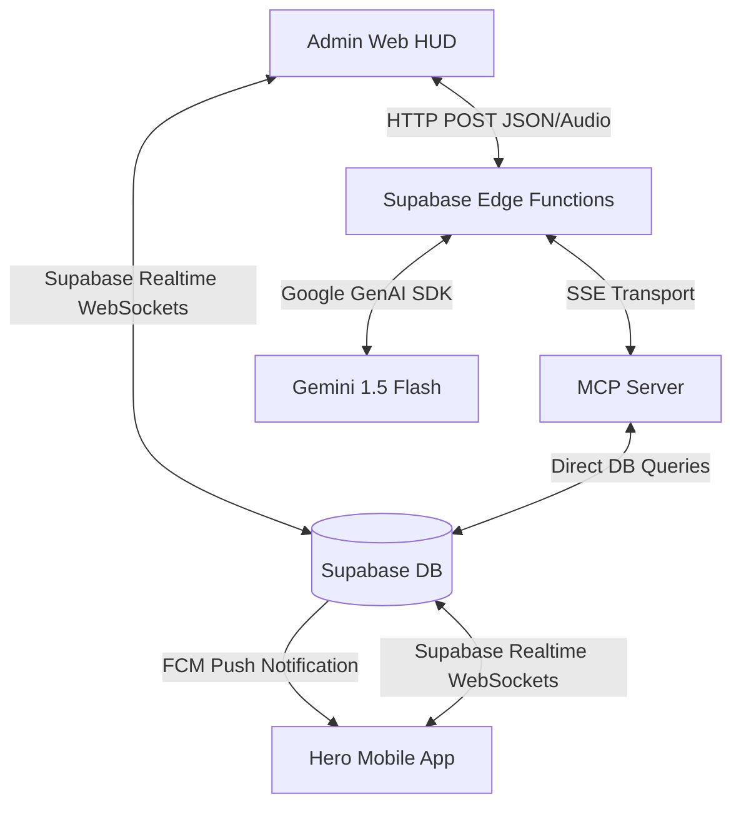
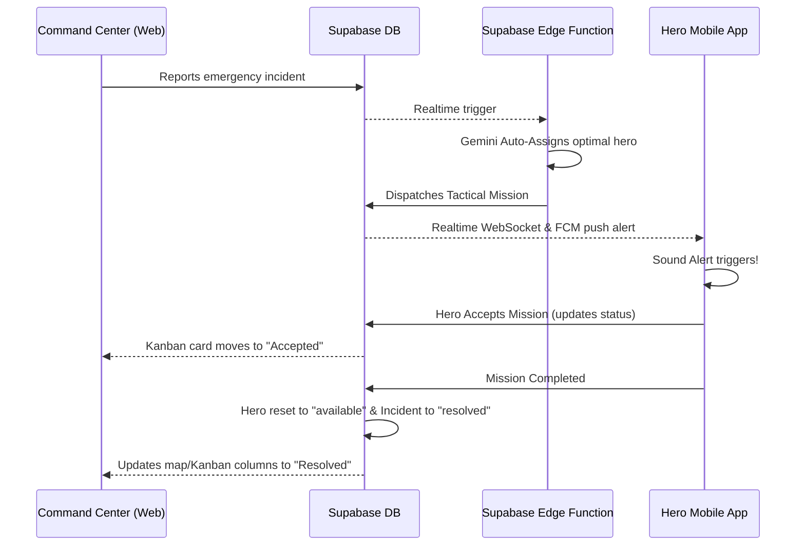

# 🛡️ A.E.G.I.S. – AI-Powered Emergency Guardian Intelligence System

> **"Superheroes don't have a power problem. They have a coordination problem."**
> 
> *Even if we possess immense power, it is entirely pointless without real-time tactical coordination.*

🌐 **Live Dashboard Console**: [https://shield-x-taupe.vercel.app/](https://shield-x-taupe.vercel.app/)

<p align="center">
  <span style="color: #ff3860; font-weight: bold;">⚠️ WARNING: The MCP Server is powered by Gemini. Use it wisely.</span>
</p>

---

## 1. System Overview
A.E.G.I.S. (Adaptive Emergency & Guardian Intelligence System) is a state-of-the-art tactical response ecosystem designed to coordinate superhero resources, active emergency incidents, and command centers in real time. 

Built for high-stakes operation centers, it bridges the gap between ground-level heroes (using their mobile device terminals) and administrators (using a cyber-cybernetic HUD Command Center Dashboard) via an AI-driven dispatch core and **Model Context Protocol (MCP)** voice/text interfaces.

---

## 2. System Architecture



### Four Core Subsystems:
1. **Command Center Dashboard (`web-app/`)**: React (Vite + TypeScript) cyber-themed tactical console. Features live incident monitoring, interactive telemetry map tracking, automated AI dispatch recommendation panel, and a live AI Voice Terminal.
2. **Hero Mobile App (`Mobile_App/`)**: Expo React Native mobile application for ground operatives. Features real-time emergency dispatch alerts with synthesised system warnings, geolocation tracking, Google OAuth 2.0 cleared accounts, and native offline-ready audio recordings.
3. **MCP Server (`mcp/`)**: Node.js Model Context Protocol server exposing database APIs as structured tools (e.g. `get_hero_status`, `dispatch_hero`) for LLM query execution.
4. **Supabase Backend (`supabase/`)**: Live PostgreSQL database, Realtime replication layer, and Edge Functions:
   - `voice-agent`: Converts text/audio base64 requests to live database actions using Gemini 1.5 Flash and the MCP client transport.
   - `auto-assign`: Automatically analyzes incoming incidents and updates assigned hero statuses.

---

## 3. Core Database Lifecycle

The system utilizes a fully connected relational database structure matching three core tables: `incidents`, `missions`, and `heroes`.



---

## 4. Setup & Running Instructions

### Prerequisites
- Node.js (v18+)
- npm / npx
- Expo Go App (for testing the Mobile App)
- Supabase CLI (if modifying Edge functions locally)

---

### Subsystem 1: Supabase Backend
1. Go to your [Supabase Dashboard](https://supabase.com).
2. Configure your Environment Variables in `.env` (copy values from `web-app/.env` or `Mobile_App/.env`).
3. If running Edge Functions locally:
   ```bash
   cd supabase
   supabase start
   ```
4. Deploy the functions to your live instance:
   ```bash
   supabase functions deploy voice-agent
   supabase functions deploy auto-assign
   ```

---

### Subsystem 2: Command Center Web App (`web-app/`)
The tactical HUD dashboard is built with React, Vite, and Tailwind.

1. Navigate to the folder:
   ```bash
   cd web-app
   ```
2. Install dependencies:
   ```bash
   npm install
   ```
3. Set up the Environment File (`.env`):
   ```env
   VITE_API_URL=http://localhost:3000
   VITE_SUPABASE_URL=https://your-project-ref.supabase.co
   VITE_SUPABASE_ANON_KEY=your-anon-public-key
   ```
4. Run the Dev Server:
   ```bash
   npm run dev
   ```
5. Build for production deployment:
   ```bash
   npm run build
   ```

---

### Subsystem 3: Hero Mobile App (`Mobile_App/`)
The React Native app uses Expo and runs natively on iOS and Android.

1. Navigate to the folder:
   ```bash
   cd Mobile_App
   ```
2. Install dependencies:
   ```bash
   npm install
   ```
3. Create a `.env` file matching local settings:
   ```env
   EXPO_PUBLIC_SUPABASE_URL=https://your-project-ref.supabase.co
   EXPO_PUBLIC_SUPABASE_ANON_KEY=your-anon-public-key
   ```
4. Start Expo developer server:
   ```bash
   npx expo start
   ```
5. Scan the QR code using the **Expo Go** app on your iOS/Android device.

---

### Subsystem 4: Model Context Protocol (MCP) Server (`mcp/`)
The MCP Server provides structured interfaces for the voice agent to interact directly with database schemas.

1. Navigate to the folder:
   ```bash
   cd mcp
   ```
2. Install dependencies:
   ```bash
   npm install
   ```
3. Run compiler:
   ```bash
   npm run build
   ```
4. Start the server (for local execution):
   ```bash
   npm start
   ```
5. To deploy the server persistently under a process manager (e.g. on a VPS):
   ```bash
   pm2 start ecosystem.config.cjs
   ```

---

## 5. Key Features

### 1. Offline-Ready Native Voice Input
Due to Web Speech API network drops in browser containers, A.E.G.I.S. records user audio locally using the standard **HTML5 MediaRecorder API**. Audio is compiled to base64 `webm` packets, bypasses Chrome speech dependencies entirely, and is processed natively by Gemini 1.5 Flash on the Edge Server.

### 2. Interactive Voice Playback
Voice logs record in the chat console and feature an inline dark-HUD audio player widget. Operatives and Command Center directors can play back historical voice dispatches directly from inside their chat log bubbles.

### 3. Dispatch-Lock Constraints
To prevent chaotic status transitions, Command Center directors are restricted to **Dispatch-Only** privileges. Administrators can create, assign, and broadcast missions, but the mission lifecycle (Accepted, En Route, Completed) remains strictly locked to the Hero's secure mobile account authorization.
